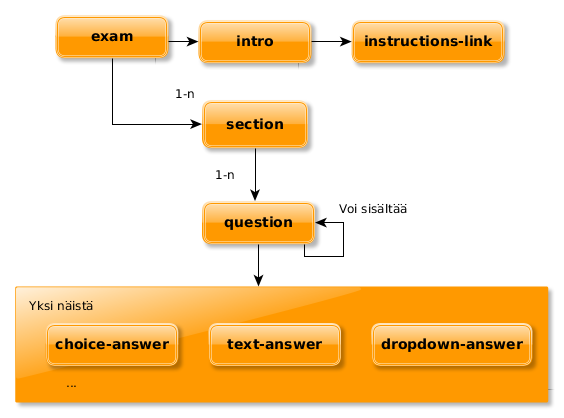
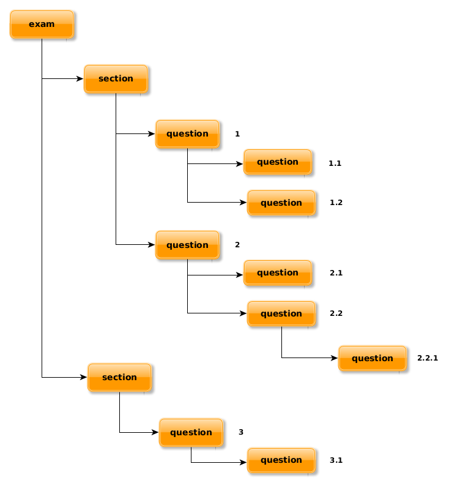
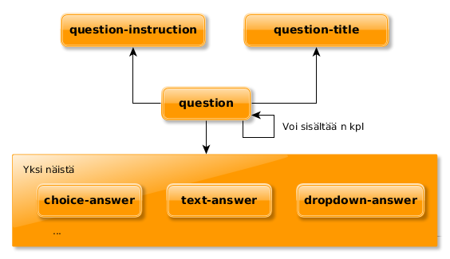
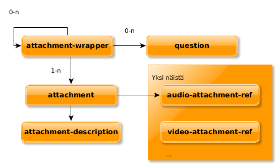

# Koeformaatti

Tunetaan myös nimellä "JSON 2.0" ja "Koerakenne 2".

Kokeen päätason rakenne on karkealla tasolla allaolevan kuvan kaltainen.



Koerakenne kuvataan XML:nä, jonka seassa voi olla (X)HTML tageja. 
Alla esimerkki kuvan rakenteesta XML/HTML muotoisena. 

_Huom: XML:n nimiavaruuksien ominaisuuksista johtuen joko koeformaatin tageihin tai HTML-tageihin pitää laittaa etuliite, jotta
ne pystytään erottamaan toisistaan. Tässä dokumentissa käytäntönä on, että koeformaatin tageihin viitataan esimerkeissä etuliitteellä `e:`, joten
esimerkiksi `<exam>`-tagista tulee `<e:exam>`. Vain XML-esimerkeissä käytetään etuliitettä, muuten tagien nimet esiintyvät tässä dokumentissa sellaisenaan._

## Esimerkki

```xml
<e:exam  xmlns:y="http://ylioppilastutkinto.fi/exam.xsd" xmlns="http://www.w3.org/1999/xhtml" xmlns:xsi="http://www.w3.org/2001/XMLSchema-instance"
         xsi:schemaLocation="http://ylioppilastutkinto.fi/exam.xsd exam.xsd" date="2018-09-19" exam-code="EA" name="FI – Englanti (pitkä oppimäärä)">
    <e:exam-instruction>
        Koe koostuu kahdesta osasta...
    </e:exam-instruction>
    <e:section title="Listening Comprehension"> <!-- OSA I -->
        <e:question> <!-- Tehtävä 1 -->
            <e:question-title>Dunedin Study</e:question-title>
            <e:question-instruction>
                This is a news report, where Kim Hill interviews Richie Poulton about the Dunedin Study, a health and development study conducted in New Zealand. You can listen to this part twice: first straight through and then in short sections. Read the questions carefully and then listen to the recording.
            </e:question-instruction>
            <e:attachment-wrapper>
                <e:attachment>
                    <e:audio-attachment-ref href="Sa%CC%88hko%CC%88inen%20koe%20(esikatselu)_files/2_003.mp3" times="1"/>
                    <e:attachment-description>
                        The whole recording
                    </e:attachment-description>
                </e:attachment>
                <e:attachment-wrapper>
                    <e:question> <!-- Tehtävä 1.1 -->
                        <e:question-label>
                            Mark: Don’t forget about tomorrow night – it’s Frank’s twenty-first birthday party. Dave: <b>Really?</b> Is he only twenty-one? Is Dave
                        </e:question-label>
                        <e:choice-answer>
                            <e:choice-answer-option score="2">
                                surprised?
                            </e:choice-answer-option>
                            <e:choice-answer-option>
                                skeptical?
                            </e:choice-answer-option>
                            <e:choice-answer-option>
                                amused?
                            </e:choice-answer-option>
                        </e:choice-answer>
                        <e:attachment>
                            <e:audio-attachment-ref href="Sa%CC%88hko%CC%88inen%20koe%20(esikatselu)_files/2_002.mp3" times="1"/>
                            <e:attachment-description>
                                The passage related to question 1.1.
                            </e:attachment-description>
                        </e:attachment>
                    </e:question>
                </e:attachment-wrapper>
                <e:attachment-wrapper>
                    <e:question> <!-- Tehtävä 1.2 -->
                        <e:question-label>
                            Mark: I think so. No, wait. <b>He must be just twenty?</b> Mark sounds
                        </e:question-label>
                        <e:choice-answer>
                            <e:choice-answer-option score="2">
                                uncertain
                            </e:choice-answer-option>
                            <e:choice-answer-option>
                                shocked
                            </e:choice-answer-option>
                            <e:choice-answer-option>
                                surprised
                            </e:choice-answer-option>
                        </e:choice-answer>
                    </e:question>
                    <e:question> <!-- Tehtävä 1.3 -->
                        <e:question-label>
                            Dave: <b>Really?</b> He looks older. Dave is expressing
                        </e:question-label>
                        <e:choice-answer>
                            <e:choice-answer-option score="2">
                                disbelief
                            </e:choice-answer-option>
                            <e:choice-answer-option>
                                realisation
                            </e:choice-answer-option>
                            <e:choice-answer-option>
                                uncertainty
                            </e:choice-answer-option>
                        </e:choice-answer>
                    </e:question>
                    <e:attachment>
                        <e:audio-attachment-ref href="Sa%CC%88hko%CC%88inen%20koe%20(esikatselu)_files/2.mp3" times="1"/>
                        <e:attachment-description>
                            The passage related to question 1.2. and 1.3.
                        </e:attachment-description>
                    </e:attachment>
                </e:attachment-wrapper>
            </e:attachment-wrapper>
        </e:question>
    </e:section>
    <e:section title="Grammar and Vocabulary"> <!-- OSA II -->
        <e:question> <!-- Tehtävä 2 -->
            <e:question-instruction>
                <b>Choose the alternative that best fits the context. (9 p.)</b>
            </e:question-instruction>
            <e:question-title>
                Art of Living Car-lessly in the City
            </e:question-title>
            I firstly realised that owning a car in a city is slightly demented when a friend in Manhattan
            <e:question> <!-- Tehtävä 2.1 -->
                <e:dropdown-answer>
                    <e:dropdown-answer-option score="1">
                        lent
                    </e:dropdown-answer-option>
                    <e:dropdown-answer-option>
                        adopted
                    </e:dropdown-answer-option>
                    <e:dropdown-answer-option>
                        borrowed
                    </e:dropdown-answer-option>
                    <e:dropdown-answer-option>
                        received
                    </e:dropdown-answer-option>
                </e:dropdown-answer>
            </e:question>
            me her Upper West Side apartment for a month. When I arrived, I discovered the catch for her seeming generosity – the keys to her Jeep Cherokee and a breezy request to “look after it”,
            <e:question> <!-- Tehtävä 2.2 -->
                <e:dropdown-answer>
                    <e:dropdown-answer-option score="1">
                        starting
                    </e:dropdown-answer-option>
                    <e:dropdown-answer-option>
                        start
                    </e:dropdown-answer-option>
                    <e:dropdown-answer-option>
                        starts
                    </e:dropdown-answer-option>
                    <e:dropdown-answer-option>
                        started
                    </e:dropdown-answer-option>
                </e:dropdown-answer>
            </e:question>
            with “Please move it for street cleaning after five pm today”.
        </e:question>
    </e:section>
    <e:section title="Production"> <!-- OSA III -->
        <e:section-instruction>
            <b>
                Write a composition of 700–1,300 characters on one of the topics below, following the instructions. Spaces and line breaks
                are not included in the character count.
            </b>
        </e:section-instruction>
        <e:question max-answers="1"> <!-- Tehtävä 3 -->
            <e:question max-score="99"> <!-- Tehtävä 3.1 -->
                <e:question-instruction>
                    You are giving a speech at your graduation event to all the new graduates. Your topic is Future Working Life. Write your
                    speech using the ideas from the mind map. You should include at least three of the main themes in your speech.
                </e:question-instruction>
                <e:text-answer size="large"/>
            </e:question>
            <e:question max-score="99"> <!-- Tehtävä 3.2 -->
                <e:question-title>
                    <b>Blog postcard</b>
                </e:question-title>
                <e:question-instruction>
                    You are spending a semester abroad as an exchange student, and the organisation
                    arranging the exchange requires that all exchange students send a “blog postcard” to the organisation’s blog.
                    In the blog postcard, the students should briefly describe their studies there and the target culture in general
                    and compare them with their home country. Write your blog postcard.
                </e:question-instruction>
                <e:text-answer size="large"/>
            </e:question>
        </e:question>
    </e:section>
</e:exam>
```

## Tehtävien numerointi

Tehtäviä ei numeroida eksplisiittisesti, vaan numerointi luodaan automaattisesti koerakenteen perusteella. Päätasolla (suoraan `section`:in alla) olevat
kysymykset saavat kasvavan numeron: 1, 2, 3…. Alikysymykset saavat vastaavasti numeron: 1.1, 1.2, 1.3… ja niin edelleen. Rakenne sallii
myös alikysymyksille alikysymyksiä (periaatteessa hierarkia voi olla miten syvä tahansa), jolloin numerointi näyttäisi tältä: 1.1.1, 1.1.2, ….
`section`-tagit eivät vaikuta numerointiin, vaan se numerointi jatkuu niiden yli. Esimerkiksi toisessa `section`:issa oleva `question` numero 2 jatkaa ensimmäisessä `section`:issa olevan kysymyksen numerointia.



[Alun esimerkissä](#Esimerkki) on merkitty `question`-tageista luotavat numerot kommentein (esim. `<!-- Tehtävä 1 -->`)

## exam

Kokeen päätason rakenne. Sisältää [osioita (`section`)](#section) sekä seuraavia attribuutteja:

| Attribuutti | Tyyppi                | Pakollinen   | Kuvaus            |
|-------------|-----------------------|--------------|-------------------|
| date        | päivämäärä (ISO date) | Kyllä        | kokeen päivämäärä |
| name        | teksti                | Kyllä        | kokeen nimi       |
| exam-code   | teksti                | kokeen koodi |                   |

Koe voi sisältää seuraavia tageja:

| Tagi             | Kuvaus                                                            |
|------------------|-------------------------------------------------------------------|
| exam-instruction | Kokeen kuvaus/päätason ohjeet, voi sisältää HTML-tageja           |
| section          | Kokeen osiot, jotka ovat `exam`:in alla. Ks [`section`](#section) |

Esimerkki:

```xml
<e:exam date="2018-09-19" name="FI - Filosofia" exam-code="FF">
  <e:exam-instruction>
    Koe on kaksiosainen. Osassa I on kuusi 20 pisteen tehtävää ja osassa II kolme 30 pisteen tehtävää. Saat vastata enintään viiteen tehtävään. Näistä tehtävistä enintään kaksi saa olla osasta II. Kokeen maksimipistemäärä on 120. Sen saavuttaminen edellyttää, että vastaat kolmeen osan I tehtävään ja kahteen osan II tehtävään. Vastauksiin ei ole mahdollista liittää kuvakaappauksia.

    Älä jätä mitään merkintöjä sellaisen tehtävän vastaukselle varattuun tilaan, jota et halua jättää arvosteltavaksi.

    OSA I
    20 p. tehtävät. Vastaa 3–5 tehtävään. 
    <ul>
        <li>Kauneus on katsojan silmässä</a> (ei aineistoa)</li>
        <li>Moraali ja tavat</a> (ei aineistoa)</li>
    </ul>    
    ...
  </e:exam-instruction>
  ...
</e:exam>
```

## section

Koe jakautuu osiin, jotka kuvataan `section`-tagilla. Sectionien sisällä voi olla yksi tai useampia ryhmitteleviä [`question`-tageja](#question) tai 
[kysymys-tageja](#Kysymystagit). 

| Attribuutti | Kuvaus                                                                                                                                           |
|-------------|--------------------------------------------------------------------------------------------------------------------------------------------------|
| max-answers | Maksimivastausten määrän rajoittaminen. max-answersin ollessa määritelty vain yhteen tehtävään saa vastata/vain yhdestä tehtävästä saa pisteitä. |
| title       | Osion otsikko                                                                                                                                    |

*Esimerkki:*
```xml
<e:section max-answers="1" title="Otsikko">...</e:section>
```

## question

`question`-tagi pitää sisällään joko [vastaus-tagin](#Vastaustagit) tai alikysymyksiä (`question`-tageja). Ks [Tehtävien numerointi](#tehtävien-numerointi).



| Attribuutti | Tyyppi       | Pakollinen                                              | Kuvaus                                                                                                                                                                                           |  |
|-------------|--------------|---------------------------------------------------------|--------------------------------------------------------------------------------------------------------------------------------------------------------------------------------------------------|--|
| max-answers | Kokonaisluku | Ei                                                      | Myös tällä tasolla pystyy määrittämään `max-answers`:in kuten `section`:issa. max-answersin ollessa määritelty vain näin moneen tehtävään saa vastata/vain näin monesta tehtävästä saa pisteitä. |  |
| max-score   | Kokonaisluku | Jos sisältä löytyy `text-answer` tai `rich-text-answer` | Maksimipisteet vastaukselle                                                                                                                                                                      |  |

Question voi sisältää seuraavia tageja:

| Tagi                 | Kuvaus                                         |
|----------------------|------------------------------------------------|
| question-title       | Otsikko kysymykselle, voi sisältää HTML-tageja |
| question-instruction | Kysymyksen ohjeet, voi sisältää HTML-tageja    |
| Joku vastaustageista | [Ks. vastaustagit](#Vastaustagit)              |

```xml
<e:question max-score="99">
    <e:question-title>
        <b>Blog postcard</b>
    </e:question-title>
    <e:question-instruction>
        You are spending a semester abroad as an exchange student, and the organisation
        arranging the exchange requires that all exchange students send a “blog postcard” to the organisation’s blog.
        In the blog postcard, the students should briefly describe their studies there and the target culture in general
        and compare them with their home country. Write your blog postcard.
    </e:question-instruction>
    <e:text-answer size="large"/>
</e:question>

```

## Vastaustagit

Vastaustagit ovat aina `question`-tagin alla. Niistä luodaan käytännössä jonkinlainen syöttökenttä kokeeseen, esimerkiksi 
pudotusvalikko tai tekstikenttä.

### text-answer

Tekstivastaus.

| Attribuutti | Tyyppi | Pakollinen | Kuvaus                                                     |
|-------------|--------|------------|------------------------------------------------------------|
| size        | Teksti | Ei         | "large" tai "normal" (iso tai pieni). Oletusarvo "normal". |

Esimerkki: 

```xml
<e:text-answer size="large"/>
```

*Huom:* `text-answer` vaatii, että ympäröivässä `question` tagissa on oltava `max-score`-attribuutti.

Jos kyseessä on vastaus produktiiviseen aukkotehtävään, `text-answer`-tagin sisällä on yksi tai useampia `correct-answer`-tageja:

```xml
<e:text-answer>
    <correct-answer>was elected</correct-answer>
    <correct-answer>got elected</correct-answer>
</e:text-answer>
```

### rich-text-answer

Tekstivastaus joka voi sisältää kaavoja ja kuvia.

```xml
<e:rich-text-answer/>
```

*Huom:* `rich-text-answer` vaatii, että ympäröivässä `question` tagissa on oltava `max-score`-attribuutti.

### choice-answer

Valintakomponentti vaihtoehdoista, joista vain yksi on oikein. Käytännössä "radiobutton"-komponentti.
Sisältää `choice-answer`-tageja, jolla on yksi attribuutti:

| Attribuutti | Tyyppi       | Pakollinen                                                           | Kuvaus                   |
|-------------|--------------|----------------------------------------------------------------------|--------------------------|
| score       | Kokonaisluku | Yhdellä `choice-answer-option`:illa pitää olla yli nollan pistemäärä | Pistemäärä vaihtoehdosta |


Esimerkki, jossa ensimmäisestä valinnasta saa pisteitä:
```xml
<e:choice-answer>
    <e:choice-answer-option score="2">
        surprised?
    </e:choice-answer-option>
    <e:choice-answer-option>
        skeptical?
    </e:choice-answer-option>
    <e:choice-answer-option>
        amused?
    </e:choice-answer-option>
</e:choice-answer>
```

### dropdown-answer

Kuten `choice-answer`, valintakomponentti vaihtoehdoista, joista vain yksi on oikein. Käytännössä "select"-komponentti.
Sisältää `dropdown-answer-option`-tageja, jolla on yksi attribuutti:

| Attribuutti | Tyyppi       | Pakollinen                                                             | Kuvaus                   |
|-------------|--------------|------------------------------------------------------------------------|--------------------------|
| score       | Kokonaisluku | Yhdellä `dropdown-answer-option`:illa pitää olla yli nollan pistemäärä | Pistemäärä vaihtoehdosta |

Esimerkki:
```xml
<e:dropdown-answer>
    <e:dropdown-answer-option score="1">
        lent
    </e:dropdown-answer-option>
    <e:dropdown-answer-option>
        adopted
    </e:dropdown-answer-option>
    <e:dropdown-answer-option>
        borrowed
    </e:dropdown-answer-option>
    <e:dropdown-answer-option>
        received
    </e:dropdown-answer-option>
</e:dropdown-answer>
```

## Attachments



### attachment-wrapper

Sisältää `attachment`-tageja, mahdollisesti siihen liittyviä kysymyksiä sekä mahdollisesti `attachment-wrapper`-tageja. 
Tällä kytketään kysymykset liitemateriaaliin, ja sisäkkäisillä `attachment-wrapper`-tageilla voi lisäksi esimerkiksi jakaa isomman materiaalin
pienempiin osiin (ulommassa `attachment-wrapper`-tagissa koko materiaali, sitten sisemmässä `attachment-wrapper`-tagissa osat).

### attachment

| Tagi                       | Kuvaus                                        |
|----------------------------|-----------------------------------------------|
| attachment-description     | Liitteen kuvaus, teksti tai HTML              |
| Joku liiteviittaustageista | [Ks. liiteviittaustagit](#Liiteviittaustagit) |

### Liiteviittaustagit

Liiteviittaustageja ovat:

* `audio-attachment-ref`
* `video-attachment-ref`
* _TODO: muita_

Niillä on samat attribuutit:

| Attribuutti | Tyyppi       | Pakollinen | Kuvaus                                                                             |
|-------------|--------------|------------|------------------------------------------------------------------------------------|
| href        | URL          | Kyllä      | Viittaus tiedostoon                                                                |
| times       | Kokonaisluku | Ei         | Kertoo audio- tai videotiedoston tapauksessa, montako kertaa tiedoston saa toistaa |

### Esimerkki

```xml
<e:attachment-wrapper>
    <e:question>
        <e:question-label>
            Mark: I think so. No, wait. <b>He must be just twenty?</b> Mark sounds
        </e:question-label>
        <e:choice-answer>
            <e:choice-answer-option score="2">
                uncertain
            </e:choice-answer-option>
            <e:choice-answer-option>
                shocked
            </e:choice-answer-option>
            <e:choice-answer-option>
                surprised
            </e:choice-answer-option>
        </e:choice-answer>
    </e:question>
    <e:question>
        <e:question-label>
            Dave: <b>Really?</b> He looks older. Dave is expressing
        </e:question-label>
        <e:choice-answer>
            <e:choice-answer-option score="2">
                disbelief
            </e:choice-answer-option>
            <e:choice-answer-option>
                realisation
            </e:choice-answer-option>
            <e:choice-answer-option>
                uncertainty
            </e:choice-answer-option>
        </e:choice-answer>
    </e:question>
    <e:attachment>
        <e:audio-attachment-ref href="Sa%CC%88hko%CC%88inen%20koe%20(esikatselu)_files/2.mp3" times="1"/>
        <e:attachment-description>
            The passage related to question 1.2. and 1.3.
        </e:attachment-description>
    </e:attachment>
</e:attachment-wrapper>

```